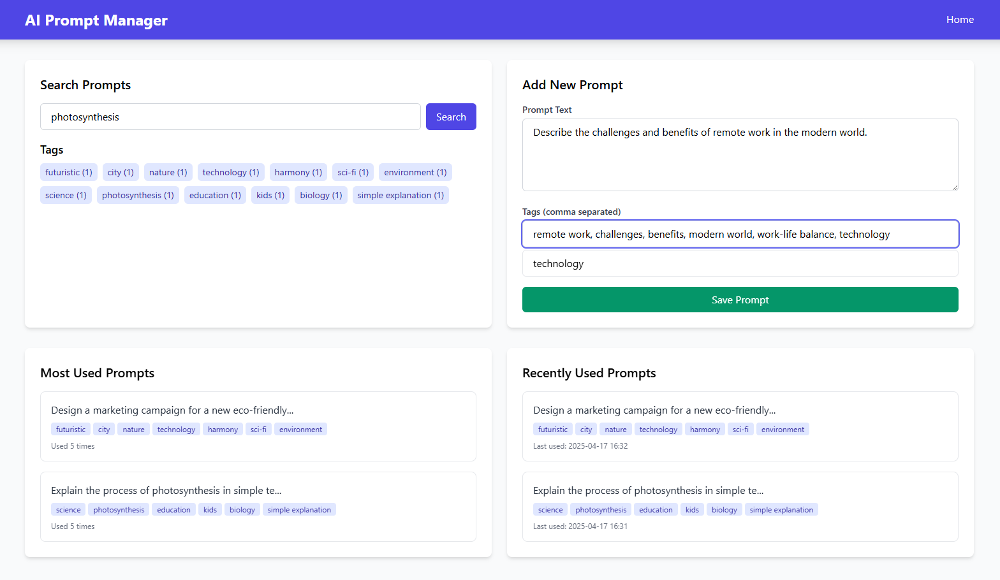

# AI Prompt Search & History System

A comprehensive system for storing, retrieving, and managing AI prompts using advanced data structures for efficient search and retrieval.

<div align="center">
  
</div>

## Features

- **Fast Prompt Lookup**: Retrieve prompts instantly using hash tables with extendible hashing
- **Tag-based Autocomplete**: Quickly find prompts by tag with trie-based autocomplete
- **Full-text Search**: Search within prompt text using suffix trees
- **Usage Analytics**: Track most used prompts with max heap prioritization
- **Recency Tracking**: Access recently used prompts via splay tree implementation
- **Data Persistence**: Store and retrieve data between sessions

## Project Structure

```
prompt-manager/
│
├── main.py                  # Main FastAPI application
├── data_structures/         # Data structure implementations
│   ├── __init__.py
│   ├── trie.py              # Compressed Trie for tag-based autocomplete
│   ├── hash_table.py        # Extendible Hashing implementation
│   ├── suffix_tree.py       # Suffix Tree for substring search
│   ├── heap.py              # Max Heap for top/most-used prompts
│   └── splay_tree.py        # Splay Tree for recency-based ranking
├── persistence.py           # Handles data persistence
├── requirements.txt         # Project dependencies
├── data/                    # Data storage directory
│   └── prompt_store.pkl     # Persistent data storage
│
└── templates/               # HTML templates
    └── index.html           # Main web interface
```

## Technical Implementation

### Data Structures

- **Hash Table**: Implements extendible hashing with cuckoo hashing for collision resolution
- **Compressed Trie**: Memory-efficient prefix tree for autocomplete functionality
- **Suffix Tree**: Fast substring search capabilities
- **Max Heap**: Priority queue implementation for tracking most used prompts
- **Splay Tree**: Self-adjusting binary search tree for optimizing recent accesses

### Web Interface

- Clean, responsive UI using Tailwind CSS
- Interactive features with JavaScript
- FastAPI backend for rapid API responses

## Getting Started

### Prerequisites

- Python 3.8+
- pip (Python package manager)

### Installation

1. Clone this repository
   ```
   git clone https://github.com/yourusername/prompt-manager.git
   cd prompt-manager
   ```

2. Install dependencies
   ```
   pip install -r requirements.txt
   ```

3. Run the application
   ```
   python main.py
   ```

4. Access the web interface at http://localhost:8000

## Usage Guide

### Managing Prompts

1. **Add a Prompt**:
   - Enter prompt text and tags (comma-separated) in the form
   - Click "Save Prompt"

2. **Search for Prompts**:
   - Search by text: Enter keywords in the search box
   - Search by tag: Click on tags in the tag cloud

3. **View Prompt Details**:
   - Click on any prompt to see its full details
   - View usage statistics and timestamps

4. **Use a Prompt**:
   - Click "Use Prompt" to increment its usage counter

5. **Delete a Prompt**:
   - Click "Delete" on the prompt details page

### Tag System

- Tags are autocompleted as you type
- Tags provide a quick way to categorize and find prompts
- The tag cloud shows all available tags with their counts

## Algorithmic Complexity

| Operation | Time Complexity | Data Structure |
|-----------|----------------|----------------|
| Prompt Lookup | O(1) average | Extendible Hash Table |
| Tag Autocomplete | O(m) where m is prefix length | Compressed Trie |
| Substring Search | O(m) where m is substring length | Suffix Tree |
| Get Most Used | O(k log n) for top k prompts | Max Heap |
| Recent Access | O(log n) amortized | Splay Tree |

## Development

### Adding New Features

1. Implement new data structures in `data_structures/` directory
2. Update `main.py` to use the new data structures
3. Modify `persistence.py` to persist new data types
4. Update the UI in `templates/index.html`

### Testing

Run manual tests for each component:
- Verify prompt storage and retrieval
- Test search functionality
- Confirm tag-based filtering
- Check usage and recency tracking